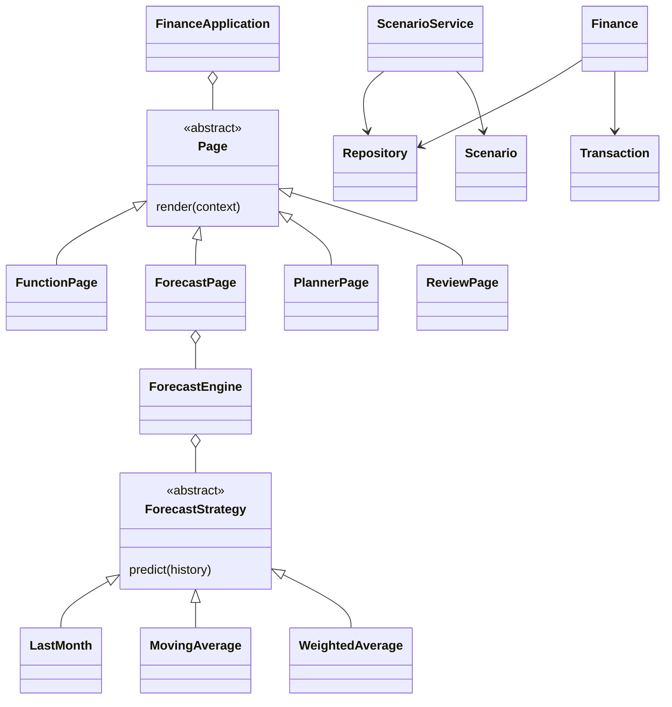

# Advanced design and evaluation

## Scope of this upgrade

The project now includes a Forecast Lab, saved what-if scenarios, historical spending review, and a daily spending chart. The presentation uses a shared color system, animated entry and hover states, responsive styling, and a reduced-motion override. These additions support a postgraduate project demonstration; the academic level ultimately depends on the institution's rubric, research, evaluation, and written analysis.

## Object-oriented design

| Component | Responsibility | Design principle |
| --- | --- | --- |
| Transaction and Scenario | Immutable validated domain values and document conversion | Encapsulation and domain validation |
| Repository protocol | Defines the storage operations needed by services | Dependency inversion and structural typing |
| Finance and ScenarioService | Account-scoped business operations | Separation of responsibilities and dependency injection |
| ForecastStrategy | Abstract prediction contract | Polymorphism and Strategy pattern |
| LastMonth, MovingAverage, WeightedAverage | Interchangeable forecasting algorithms | Open for extension through new strategies |
| ForecastEngine | History preparation and identical rolling evaluation | Composition and testable orchestration |
| SpendingReviewer | Category-specific robust outlier review | Independent analysis service |
| Page and PageContext | Shared screen contract and explicit dependencies | Polymorphism |
| FunctionPage | Adapts existing screens to the page contract | Adapter pattern |
| FinanceApplication | Composes services and registers navigation pages | Composition root |

The Store continues to select SQLite or MongoDB internally. Both satisfy the Repository protocol. The upgrade preserves the existing collection fields, integer-paise representation, and account IDs, so existing records require no migration. A new `scenarios` collection stores account-specific scenario snapshots.

## Forecast experiment

The target is current-month total recorded expenses. First-observed and current months are excluded from training because they can be partial. Missing intervening months are explicitly treated as zero recorded spending; the user must assess whether that reflects missing data. At least four usable months are required: three for the first training window and one for testing.

Three baselines are compared: last month, a three-month arithmetic mean, and a recency-weighted mean of up to six months. Rolling-origin evaluation predicts each test month using only its predecessors. All models use the same folds. MAE is the average absolute prediction error in rupees. Ranking by MAE is descriptive selection on the observed backtest, not an unbiased estimate of the selected model's future performance. A rigorous research extension should reserve a separate final holdout, compare against seasonal baselines, and report performance across several sufficiently long anonymized datasets.

The chart's estimate plus/minus MAE range is illustrative, not a confidence or calibrated prediction interval. With few test folds, no accuracy claim is justified. The UI exposes fold counts and warns when fewer than six are available. No external AI service is called.

## Spending review

Each expense is compared to transactions in the same category on strictly earlier dates. At least five prior transactions are required. The review threshold is the larger of twice the median and median plus three scaled MADs; MAD is the median absolute deviation and its scale factor is 1.4826. When MAD is zero, the twice-median floor still applies. A flagged expense is an unusual-value prompt, not fraud detection. Transaction quality, category consistency, and sample size determine usefulness. The baseline uses no future transactions.

## Scenario simulation

Inputs are monthly income, monthly expenses, starting savings, expense reduction (0–100%), and horizon (1–36 months). Expenses after reduction are rounded once to paise using decimal half-up rounding. Each month adds income minus expenses. The chart compares an unchanged plan with the adjusted plan, includes month zero, and allows negative projected savings. No investment returns, inflation, borrowing, or automatic deductions are assumed. Saved snapshots are loaded through account-scoped queries, can be deleted with confirmation, and never change real transactions or savings goals.

## Evaluation checklist for the dissertation

- Use consented, anonymized data and document collection completeness.
- Compare forecasting baselines using separate temporal train/validation/test windows.
- Report MAE, number of test periods, error distributions, and limitations.
- Assess outlier-review precision using manually labeled examples, including false positives.
- Evaluate usability with task completion time, error rate, and an established questionnaire.
- Test account isolation, invalid inputs, empty/sparse histories, rounding, and UI navigation.
- Discuss why domain models, interfaces, and Strategy/Adapter patterns fit this design.

These are proposed academic evaluation steps, not experiments claimed to have been performed.

## Savings coach extension

SavingsOpportunity encapsulates exact currency reductions. SavingsCoach computes transparent category opportunities and repeated-payment candidates; SavingsPlanService persists account-owned action snapshots through Repository. DemoRepository implements the same interface in per-session memory so the complete app can be explored without creating an account. See SAVINGS_COACH.md for data rules, exclusions, limitations, and the onboarding flow.
