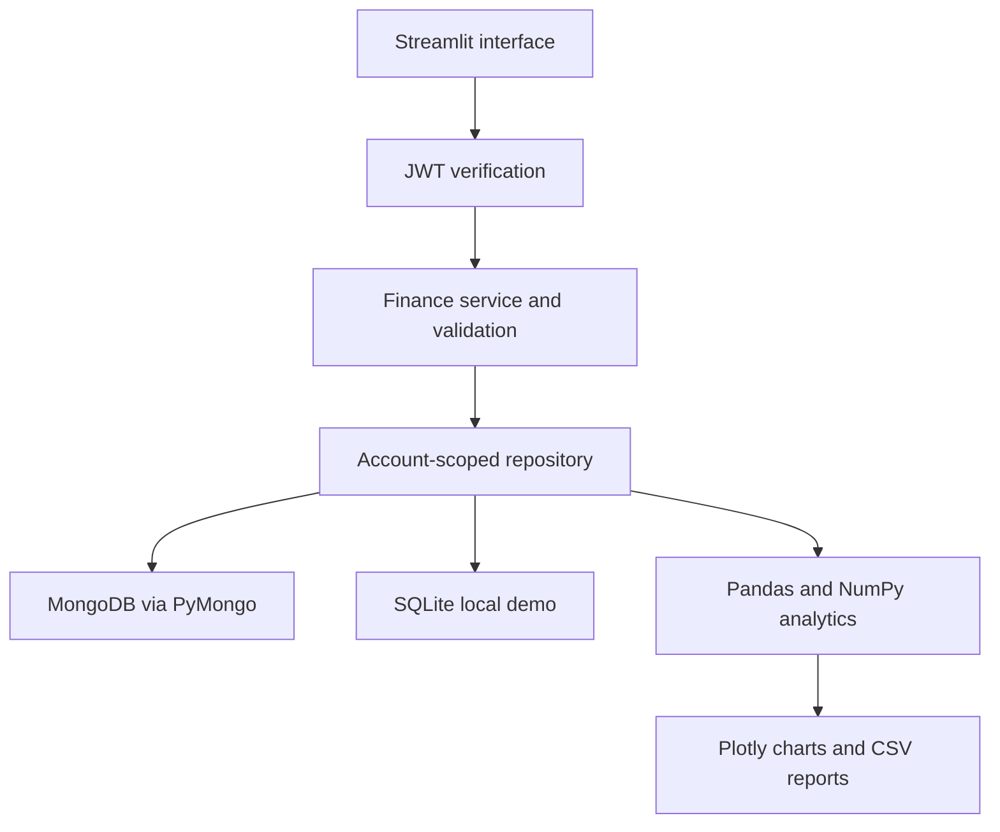

# Project guide

## Purpose

Pennywise centralizes manually recorded personal income, expenses, budgets, and savings goals. A user registers, signs in, enters records, and sees financial summaries and charts. The baseline is a tracking tool with rule-based observations.

## Architecture

## Data model

All records use random string IDs. MongoDB uses six collections. SQLite stores the same documents in a records table with account and uniqueness indexes.

| Collection | Principal fields |
| --- | --- |
| users | _id, name, email, password (bcrypt hash), created_at |
| transactions | _id, user_id, type, amount_cents, category, description, date, created_at |
| budgets | _id, user_id, period (YYYY-MM), category, limit_cents, created_at |
| saving_plans | _id, user_id, period, actions (baseline, percentage, estimate, completion), created_at |
| scenarios | _id, user_id, name, income_cents, expense_cents, opening_cents, reduction_percent, months, created_at |
| goals | _id, user_id, name, target_cents, current_cents, deadline, created_at |

The `_cents` suffix represents paise for INR. Integer storage avoids binary floating-point drift. Dates are validated ISO strings, which support chronological sorting. A unique email index prevents duplicate registration. A compound budget index enforces one category budget per account and month. User IDs are obtained from verified JWTs, not form input. Updates/deletes include the owner ID in their database predicate.

## Advanced extension

The upgraded interface adds a Forecast Lab, a What-if Planner, and Spending review. See ADVANCED_DESIGN.md for class diagrams, Strategy and Adapter patterns, forecasting methodology, and academic evaluation proposals.

## Demonstration script

1. Launch run.bat and register an account.
2. Load fictional sample data on Overview. Explain monthly metrics and all-time balance.
3. Open Transactions; add an expense with a description and date. Filter, edit, and delete it with confirmation.
4. Create a category budget below existing spending to show an overspending alert.
5. Create a savings goal, update total saved, and inspect the progress indicator.
6. Open Analytics and explain category aggregation and monthly trends.
7. Export a monthly CSV from Reports.
8. Open Forecast Lab to compare models and backtest errors.
9. Change spending reduction in What-if Planner, save a scenario, and reload it.
10. Inspect Spending review and explain why the larger sample shopping expense is flagged.
11. Sign out, register another account, and demonstrate that its records are empty.

## One-minute viva explanation

Our project is a personal finance tracker built using Python and Streamlit. MongoDB stores account-specific transactions, budgets, and savings goals. We use bcrypt for password hashing and PyJWT for expiring sessions. Business services validate input and store monetary amounts as integer paise. Pandas aggregates the records, NumPy supports numerical checks, and Plotly displays interactive charts. Users can manage transactions, monitor budgets, track goals, and export CSV reports. The architecture separates the interface, financial rules, analytics, and storage, and includes automated tests. A local SQLite mode makes classroom demonstrations easy without cloud credentials.

## Frequently asked questions

**Why bcrypt?** It is a salted, computationally expensive password hash designed to resist password guessing. Passwords are never stored in plain text.

**What does JWT do?** It signs the account identity with a server secret and expires after eight hours. Each interface rerun verifies the token before showing account data. Logout removes it from session state.

**Why MongoDB?** It stores the four document collections directly and supports indexes for uniqueness and user-specific queries.

**How is money calculated?** Inputs are validated with Decimal, converted to integer paise, summed as integers, then converted to rupees for presentation.

**Are savings goals deducted from balance?** No. Goals track a manually entered saved total independently to avoid double-counting transfers as expenses.

**Is the insight engine AI?** No. It applies explicit rules to totals, category rankings, monthly changes, and budget thresholds.

## Delivery boundaries

Included: baseline application, sample-data workflow, validation, automated tests, local launcher, database adapters, CSV reports, Docker setup, and handover documentation. Cloud publishing and live MongoDB verification require the owner's infrastructure. Bank integrations, recurring transactions, password recovery, PDF reports, and ML predictions remain future extensions described in the original brief.

## New first-time demonstration

Use Explore a live demo on the welcome screen, then Discover where I can save on Overview. Set a category reduction, save the plan, and complete an action. Review possible recurring spending and a goal timeline. Exit demo before creating your personal account. Demo records are disposable and never mixed with account data.
